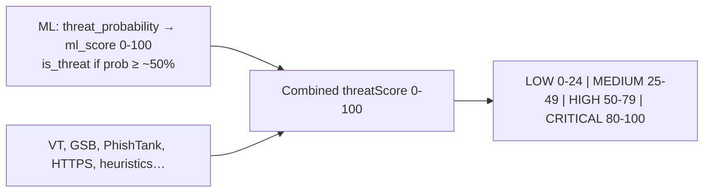

# Threat Score & Risk Ranges

How Catchers AI turns ML predictions and other checks into the **threat score** (0–100) and risk labels (**LOW**, **MEDIUM**, **HIGH**, **CRITICAL**).

---

## What you see in the UI (main threat score)

The gauge and badges use a **combined `threatScore` from 0–100**, not the raw ML percentage alone. That score is built from VirusTotal, Google Safe Browsing, PhishTank, ML, HTTPS checks, heuristics, and more, then capped at 100.

### Risk bands (final threat score)

| Risk label | Threat score range | Meaning |
|------------|-------------------|---------|
| **LOW** | **0 – 24** | Less harmful — generally safer with normal precautions |
| **MEDIUM** | **25 – 49** | Some risk — review before proceeding |
| **HIGH** | **50 – 79** | Significant risk — avoid if possible |
| **CRITICAL** | **80 – 100** | Highest risk — do not visit / quarantine |

Boundaries are **inclusive** on the upper band (e.g. exactly **50** is **HIGH**, exactly **25** is **MEDIUM**).

**Backend** (`backend/src/services/threatAnalysis.ts`):

```typescript
if (threatScore >= 80) {
  riskCategory = 'CRITICAL';
} else if (threatScore >= 50) {
  riskCategory = 'HIGH';
} else if (threatScore >= 25) {
  riskCategory = 'MEDIUM';
} else {
  riskCategory = 'LOW';
}
```

**Frontend** (`frontend/src/lib/risk.ts` — `categoryFromScore`):

```typescript
if (score >= 80) return "CRITICAL";
if (score >= 50) return "HIGH";
if (score >= 25) return "MEDIUM";
return "LOW";
```

File scans use the same thresholds in `threatAnalysis.ts`.

---

## What the ML service outputs

The Python ML service does **not** assign LOW / MEDIUM / HIGH / CRITICAL. It returns probabilities and a 0–100 ML score.

### Trained model path (Random Forest)

From `predict_proba` in `ml-service/app/ml_engine.py`:

| Field | Description |
|-------|-------------|
| **`threat_probability`** | Chance the URL/content is a threat (0.0–1.0, often shown as 0–100%) |
| **`safe_probability`** | Chance it is safe |
| **`ml_score`** | `int(threat_probability × 100)` → **0–100** |
| **`confidence`** | `max(safe_probability, threat_probability)` — how sure the model is **either way**, not “how malicious” |
| **`is_threat`** | `predict() == 1` — sklearn’s default **~50%** decision boundary |

```python
# probabilities[0] = safe, probabilities[1] = threat
safe_prob = float(probabilities[0])
threat_prob = float(probabilities[1])

is_threat = bool(prediction == 1)
confidence = max(safe_prob, threat_prob)
ml_score = int(threat_prob * 100)
```

### ML-only binary split (not the same as UI bands)

| ML `threat_probability` / `ml_score` | Model label |
|--------------------------------------|-------------|
| **0% – ~49%** | Usually **`is_threat: false`** (safe) |
| **~50% – 100%** | Usually **`is_threat: true`** (threat) |

There is **no** separate ML mapping for medium vs high vs critical — only safe vs threat at ~50%.

### Rule-based fallback (if the `.pkl` model is missing)

A weighted rule score 0–100 is used; **`is_threat` if score ≥ 50**:

```python
threat_prob = score / max_score
is_threat = score >= 50
```

---

## How ML feeds the final threat score

ML only **adds** to `threatScore` when the model says **`is_threat: true`** (`backend/src/services/threatAnalysis.ts`):

```typescript
if (mlResult.prediction.is_threat) {
  threatScore += Math.round(mlScore * mlConfidence);
}
```

- **`mlScore`** — 0–100 from the ML service  
- **`mlConfidence`** — 0–1 (`confidence` from the model)

**Example:** `ml_score = 80`, `confidence = 0.9` → adds **72** points to the combined score (before cap at 100).

If `is_threat` is false, ML does **not** increase the score; it may record a “classified as safe” security note instead.

Other engines can add large amounts independently, for example:

- VirusTotal — up to +70  
- Google Safe Browsing — up to +60  
- PhishTank — up to +50  
- HTTP without TLS — +25  
- Heuristics, shorteners, suspicious TLDs — additional points  

So a **low ML %** can still yield **HIGH** or **CRITICAL** overall, and a **high ML %** might stay **MEDIUM** if little else triggers.

---

## ML confidence labels (informational only)

These appear in scan details from `ml-service/app/feature_extractor.py`. They are **not** risk tiers.

| Model `confidence` | Message |
|--------------------|---------|
| **> 90%** | “Very high model confidence (>90%)” |
| **> 75%** | “High model confidence (>75%)” |

---

## Flow overview



---

## Quick reference

| Layer | Ranges |
|-------|--------|
| **UI risk labels** | LOW **0–24**, MEDIUM **25–49**, HIGH **50–79**, CRITICAL **80–100** (combined `threatScore`) |
| **ML threat probability** | **~0–49%** → usually safe; **~50–100%** → usually threat (`is_threat`) |
| **ML → score contribution** | Only when `is_threat`: adds `round(ml_score × confidence)` |

**Source files:**

- `backend/src/services/threatAnalysis.ts` — scoring and category assignment  
- `frontend/src/lib/risk.ts` — `categoryFromScore`  
- `ml-service/app/ml_engine.py` — ML probabilities and `ml_score`  
- `ml-service/app/feature_extractor.py` — confidence factor messages  
